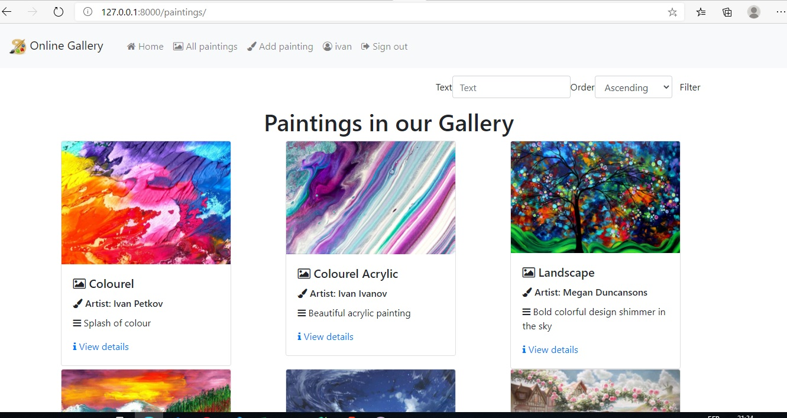
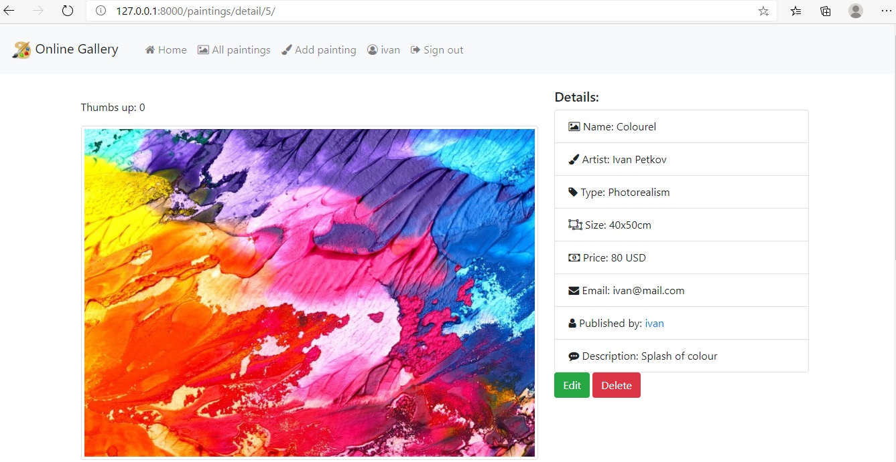

# Online Gallery
> Online Gallery is a Django based project of an online place where you can show your paintings to the public. It is made for the SoftUni's Python Web Framework November 2020 course project defence exam.  

## Table of contents
* [General info](#general-info)
* [Screenshots](#screenshots)
* [Technologies](#technologies)
* [Setup](#setup)
* [Features](#features)
* [Status](#status)
* [Inspiration](#inspiration)
* [Contact](#contact)

## General info
The Online Gallery application resembles the general functionalities of brick-and-mortar galleries. Paintings can be uploaded and displayed, viewed, liked, commented.
 

## Screenshots
#### Listing view

#### Details view

## Technologies
* Django - version 3.1.4
* Python - version 3.8
* Django Bootstrap 4 - version 2.3.1
* Pillow - version 8.0.1
* Psycopg2 - version 2.8.6
* Sqlparse - version 0.4.1

## Setup
After downloading the repo on your drive you have to open it with a IDE. In the terminal you should perform the following command "pip install -r requirements.txt" in order to install all the necessary packages. A database should be prepared and it should be configured in the settings.py file. After performing the necessary  "makemigrations" and "migrate" commands in manage.py your application is ready to be used. The landing page is desplayed at http://127.0.0.1:8000/

## Features
List of features ready and TODOs for future development
* Upload painting (only for registered users)
* Edit and delete paintings that have been uploaded by the same user (only for registered users)
* Like (thumbs up) functionality (only for registered users)
* Comment section for every painting (only for registered users)
* Browsing through the list of published paintings, search and sorting
* Admin part with full CRUD functionality.

There are three levels of access:
*Admin Level - full CRUD functions
*Registered user - CRUD of created by the user content
*Anonymous user - limited read functionalities

To-do list:
* Sorting by type of painting to be added
* Creating a section with paintigns liked by the user ("My favourites" section)

## Status
Project is: _in progress_?

## Inspiration
Project is inspired by a Bulgarian Facebook group for sharing paintings of hobby artists. Some of the functionalities are base on the materials in the course Python Web Framework at SoftUni.

## Contact
Created by Hristo Rangelov rangelov.hristo@gmail.com  - feel free to contact me!